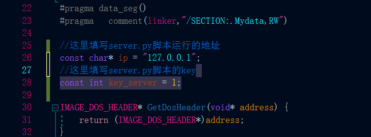

cs_c2profile_config为c2profile配置
tool为python服务器与图形化源码
exe_src为exe的源码
## - **免杀原理**
exe执行文件无特征，可执行的shellcode经过网络传输加密传送执行
tool为服务端代理，用于网络传输shellcode并执行，shellcode经过加密处理
## - **使用**
如果要启动图形化需要将生成的exe放在.\tool\raw\exeshellcode.bin，且如果要修改key则需要重新编译exe替换exeshellcode.bin，且命名需要与exeshellcode.bin同名
可以不使用图形化直接编译后在目标机执行
Server.py与 c源码中的key需要对应

## - **注意**
此脚本只针对简单静态免杀进行处理，可绕过大多数特征检测杀软，会有杀软针对vs程序进行拦截，可以复制代码到clion中重新编译
使用时请不要上传vt与微步检测，谢谢